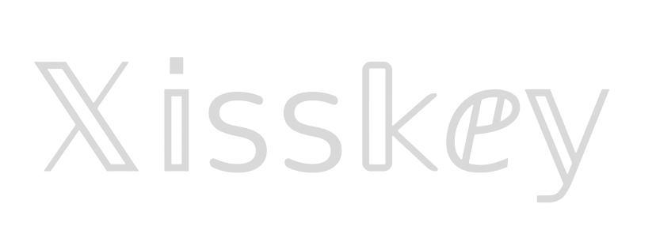

**🌎**[CherryPick](https://misskey-hub.net/)**は、永遠に無料のオープンソースで分散型のソーシャルメディアプラットフォームです！ 🚀**

---

---

## ✨ 特徴
- **ActivityPubサポート**\
CherryPickに参加していなくても大丈夫！ CherryPickインスタンス同士だけでなく、MastodonやMisskey、Pixelfedなど他のネットワークの人々とも友達になることができます！
- **リアクション**\
どんな投稿にも絵文字のリアクションを追加できます！もはや「いいね」ボタンに縛られることなく、ボタンをタップするだけで自分の気持ちをみんなに示せます。
- **ドライブ**\
CherryPickに組み込まれたドライブで、ソーシャルメディア内にクラウドストレージが利用できます。ファイルをアップロードしたり、フォルダを作成したり、自分が投稿したメディアを見つけることができます！
- **豊富なWeb UI**\
CherryPickには豊かで使いやすいWeb UIがあります！レイアウトの変更やウィジェットの追加からカスタムテーマの作成まで、高度にカスタマイズできます。さらに、AiScriptという独自のプログラミング言語を使ってプラグインを作成できます。
- その他にもたくさんの機能があります...

## ドキュメント

CherryPickのドキュメントは[Misskey Hub](https://misskey-hub.net/)で見つけることができます。上記のリンクやグラフィックも特定の部分へリンクしています。

## スポンサー

	

## 謝辞

視覚テストプラットフォームを提供してくれる[Chromatic](https://www.chromatic.com/)に感謝します。これにより、UIの変更を確認し、視覚的なリグレッションを捉えるのに役立っています。

コードカバレッジプラットフォームを提供してくれる[Codecov](https://about.codecov.io/for/open-source/)に感謝します。これにより、テストカバレッジを向上させることができます。

多言語にCherryPickを翻訳するのに役立つローカリゼーションプラットフォームを提供してくれる[Crowdin](https://crowdin.com/)に感謝します。

CherryPickを本番環境で実行するのに役立つコンテナプラットフォームを提供してくれる[Docker](https://hub.docker.com/)に感謝します。

